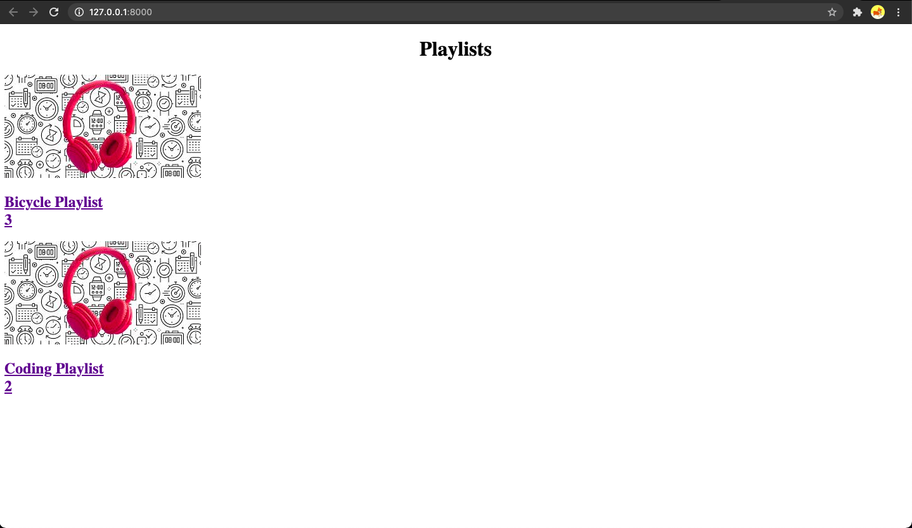
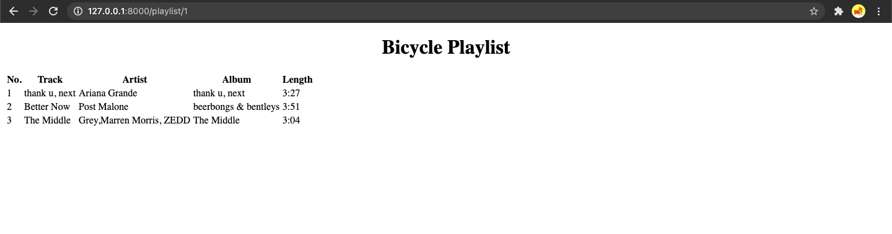
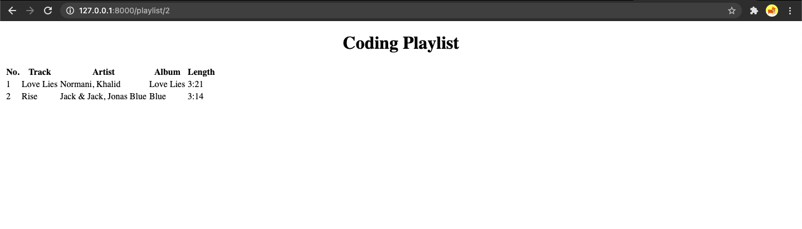

# Django Assignment 2: Music Project - Playlists and Songs

This assignment is to make you familiar with Django Templates.

## Initial Setup
- Make sure you have python and django installed.
- The project `music_project` and app `playlist` have already been created for you in this repository.
- To run the server use: `python manage.py runserver`.
- After server starts, you can visit `http://localhost:8000/` to see the changes.

## Part 1: Playlist Template

- You are provided with an array called `my_playlists` in `playlist/views.py`, containing two different playlists.
- We have already set up a template directory and included a template file by the name of `home.html`.

The tasks are briefly listed as below:
- Inject the `my_playlists` in the `home.html` using a `for` loop
- In your `home.html` file, inject both the value `name` and `numberOfSongs` key for both playlists.
- Render the template `home.html`, this has been implemented for you in the view, you just have to set the path in `playlist/urls.py` and include in the `my_project/urls.py` as done in the **first assignment**.

## Part 2: Songs Template

Now, we need a template in which we can add our songs.
For this, we have provided you with an array `my_songs`, which includes 5 songs.

You have to perform the following tasks:
- Create a new view called `playlist` and set a `dynamic route` for it such that it becomes `http://localhost:8000/playlist/n` where `n` is the integer representing the playlist `id`.
- In the `playlist` view, create a new array, `songs`, in which you are supposed to add only those songs where `playlist_id` is equal to the `id` given in the URL. Raise a `404` error if the `id` doesn't match any of the `playlist_id`.
- Also, in the `playlist` view, find the name of the playlist associated with that `id`. Render the `songs` array and the `name` of the playlist.
- A template called `songs.html` is given. Inject both the `songs` array and the `name` of the playlist into this template.
- Then, you need to add a relative URL in the `home.html` file that takes you to the `songs` view.

## Expected Outputs

### Note:
- Please DO NOT modify the `my_playlists` or `my_songs` otherwise your test cases will fail.

